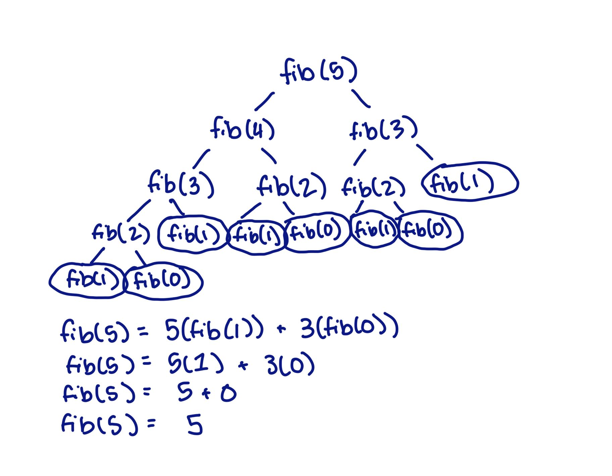
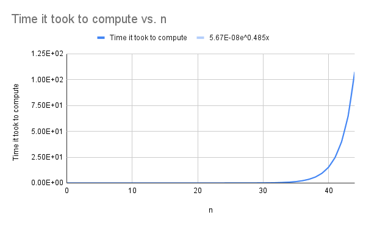

# Bingo Lyrics Recursive Program
## Problem Statement
Write a recursive method that displays the lyrics of the song “Bingo”. Write a complete demo program to test 
your recursive method.
## Algorithm
1. The recursive function for this program is the function bingo() which takes a name as a parameter. To start off,
Bingo has his full name so the function call is bingo("BINGO"). This function repeats the verses, subtracting the first
letter of Bingo's name in each verse, until it reaches the base case.
2. For the base case of the recursive function, if the length of the string that is Bingo's name at that point in
the song is equal to 0, then the function should return "The End", since there are no more letters to repeat. 
3. For the recursive case the function prints:
        There was a farmer had a dog,
        And Bingo was his name-O,
4. Then there's a for loop that repeats the letter section of that verse 3 times before printing the last line of the
verse:
        And Bingo was his name-O.
5. Inside the for loop the function prints the remaining letters of Bingo's name seperated with a dash.
6. After the last print statement the recursive case calls the bingo function again with that iteration's current name
minus the first letter. 

## Results: 
```
There was a farmer had a dog,
and Bingo was his name-O,
B-I-N-G-O!
B-I-N-G-O!
B-I-N-G-O!
And Bingo was his name-O!
There was a farmer had a dog,
and Bingo was his name-O,
I-N-G-O!
I-N-G-O!
I-N-G-O!
And Bingo was his name-O!
There was a farmer had a dog,
and Bingo was his name-O,
N-G-O!
N-G-O!
N-G-O!
And Bingo was his name-O!
There was a farmer had a dog,
and Bingo was his name-O,
G-O!
G-O!
G-O!
And Bingo was his name-O!
There was a farmer had a dog,
and Bingo was his name-O,
O!
O!
O!
And Bingo was his name-O!
The End
```

# Fibonacci Number Recursive Program
## Problem Statement
Write a recursive function that generates nth Fibonacci number. Test your code by generating 100th Fibonacci number.

## Algorithm
1. The main function of the program is fibonacci(n). The parameter n tells the function that the output should be the
nth number in the Fibonacci Sequence.
2. There are two base cases for this function because each number in the Fibonacci Sequence is the sum of the last two
numbers before it. That means for the first two there is no two preceding numbers and therefore they return themselves.
3. The recursive case is one line and it returns fibonacci(n-1) + fibonacci(n-2). This line basically recurses down until
The base case is met, which at that point would be 1's and 0's that add up to the nth number. To demonstrate this, see 
the tree diagram below for fibonacci(5) (shortened to fib).


## Results / Analysis
Generating the 100th number of the Fibonacci Sequence using a recursive function was unsuccessful. This is because 
since the Fibonacci Sequence adds the two previous numbers, the recursive statement had two calls to the function. This 
means that for every n the function runs n^2 times. This means that the time complexity of the function is O(2^n). This 
makes reaching 100 virtually impossible.

### Test
I set up a test program that printed n, the nth Fibonacci number, and used timeit to time how long it took to run the
function once.<br>
```
import timeit
for n in range(101):
    num = timeit.timeit("fibonacci(n)", setup="from __main__ import fibonacci, n", number=1)
    num2 = fibonacci(n)
    print("n =", n, "| Fibonacci number:", num2, "| Time:", num)
```

Here's a graph of the first 42 numbers. The trendline on the graph of time it took to compute the nth 
number and n was 5.67E-08e^0.485x which translates approximately to 1.63^x or 1.63^n. That means the time it would take 
for my computer to calculate the 100th number recursively would be:<br>
            1.63^100 = 1.65486E+21 Seconds<br>
            1.65486E+21/60 = 2.75809E+19 Minutes<br>
            2.75809E+19/60 = 4.59682E+17 Hours<br>
            4.59682E+17/24 = 1.91534E+16 Days<br>
            1.91534E+16/365 = 52475167492974 Years<br>
            52475167492974/1000 = 52475167493 Millennia<br>

