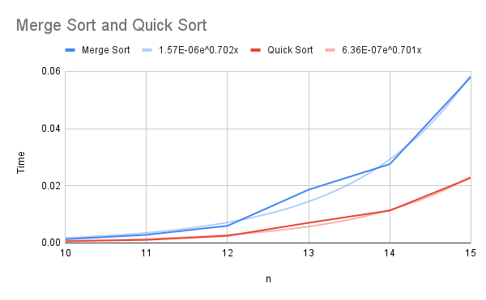

**Sorting with Merge Sort and Quick Sort**  
**Problem Statement**  
The goal of this program was to analyze and compare the performance of Merge Sort and Quick Sort algorithms on randomly generated lists of increasing sizes. The program had to meet the following requirements:

1. Implement the Merge Sort algorithm. Print the resulting array after each pass.

2. Implement the Quick Sort algorithm. Print the resulting array after each pass.

3. Using a random number generator, create lists of following sizes: 210, 211, 212, 213, 214, 215

4. Perform a benchmark analysis using the above 2 implementations of sorting algorithms.

   What is the difference in execution speed? Use timit package. (Do not use the print statements while timing the code)

**Methodology**

The program implements a Quick Sort and Merge Sort function as the sorting algorithms, these both call themselves recursively and return sorted lists. The gen\_list(n) function takes n as the exponent of 2 and generates 2n unique numbers from a pool of 2n+1 numbers. The function returns an unsorted list. 

The main function is gen\_data(), this is the function for the benchmark test, the steps of the function are as follows:  

1. A dataframe is created to store outputs of the benchmark test.   
2. Two counters are initialized to track the index positions of the test outputs for quick and Merge Sort, this is so that they can be put into the same excel sheet.   
3. A for loop is created. This loop iterates for *num* over the range 10-16. A list is created using gen\_list with *num* as the *n* parameter.  
4. Then timeit is used to test Merge Sort and Quick Sort independently with copies of the original list and save the outcomes to the dataframe with num and which algorithm was tested.  
5. Both index counters are increased by two. 

The print function is for the printing section of the program. The printed results are attached in a log.txt file since the output was greater than what PyCharm would display. The results of the benchmark test were input into an excel file for ease of calculations. To avoid affecting the benchmark test results with print statements and to avoid repeating entire blocks of code the print requirement and benchmark test were run at different times, by uncommenting and recommenting the print statements. 

**Results**

In every list size case, Quick Sort ran faster than Merge Sort. The timing data was graphed using Google Sheets. In the graph both Merge Sort (blue) and Quick Sort (red) have an exponential trendline. Exponential trendlines were chosen because they were the closest match of the actual data with a coefficient of determination (R2) of 0.99 for Merge Sort and 0.994 for Quick Sort. Though both equations have nearly identical exponents, therefore the growth rates are similar, Quick Sort’s constant is 2.5 times smaller than Merge Sort’s. This explains why Quick Sort completed each test significantly quicker than Merge Sort despite both algorithms having the same theoretical time complexity of O(*n* log *n*). 
 
